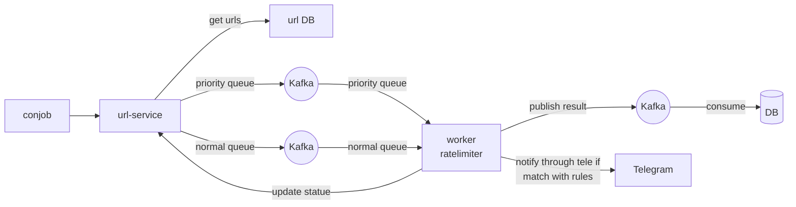
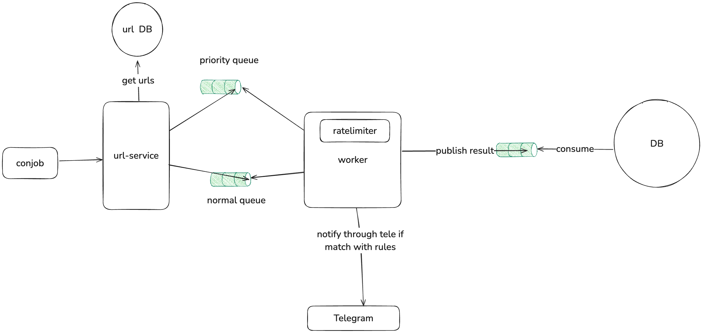
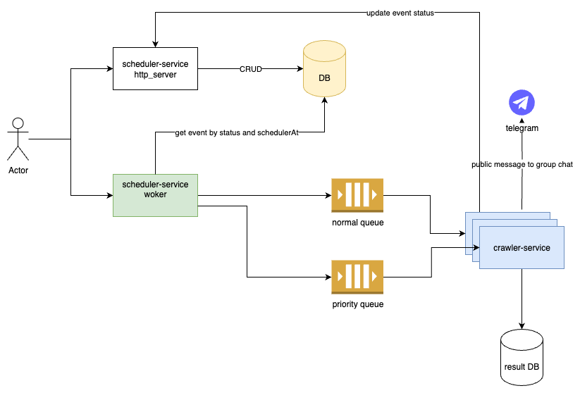
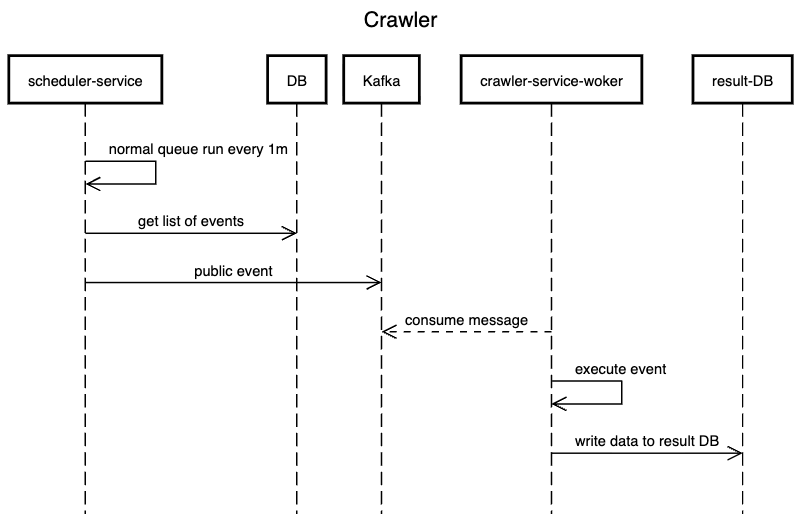
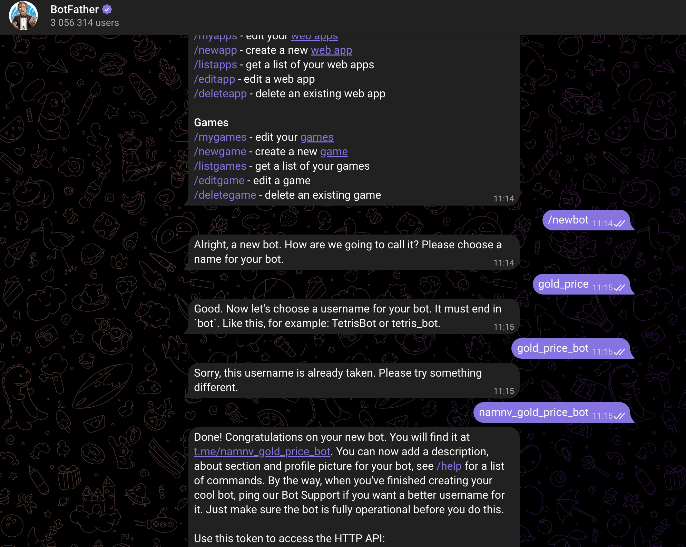

# Web Crawler

A simple Job scheduler + web crawler written in Go that crawls websites and extracts information.

## Main Features

- Add and manage event (in this case is crawler event)
- Crawls web pages starting from a given URL with method GET, POST and CURL
- Manage multiple queue with priority for crawlers
- Send message to Telegram
- Validator input data: handle dynamic by config base on different action config in yaml files to control require data or value range in `validator.go`
- Delay for retrying by asynq

## Technologies

```
- Go: 1.24
- Redis: 7-alpine
- Kafka: 3.7.1
- PostgreSQL: 17

- grpc: "google.golang.org/grpc"
- Ratelimit: "github.com/go-redis/redis_rate/v9"
- Cron job: "github.com/robfig/cron/v3"
- Gorm: "gorm.io/gorm"
- distributed locking: "github.com/go-redsync/redsync/v4"
- logging: custom to add trace_id and prefix function
- kafka: "github.com/segmentio/kafka-go"
- redis: "github.com/go-redis/redis/v8"
- telegram bot: "github.com/go-telegram-bot-api/telegram-bot-api/v5"
- robot txt: github.com/temoto/robotstxt
- asynq: "github.com/hibiken/asynq" for delay retry if it met error
- circuir breaker: "github.com/sony/gobreaker/v2"
```

## Logging example

```bash
# crawler service use "log"

[CreateCrawlerEvent] [checkInserRateLimit] 2025/12/04 00:54:52 [INFO] trace_id=4ab70ed6-44f4-4fc5-b2f4-e6cbe3c0393b - rate limit is called namnv 123
[CreateCrawlerEvent] 2025/12/04 00:54:52 [INFO] trace_id=4ab70ed6-44f4-4fc5-b2f4-e6cbe3c0393b - CreateCrawlerEvent is called


# scheduler service use "go.uber.org/zap"
{"level":"INFO","ts":"2025-12-04T19:38:34.536+0700","caller":"logging/logging.go:87","msg":"[CreateCrawlerEvent] CreateCrawlerEvent is called before","trace_id":"9c8c1d83-b854-48cd-a487-fc233abf0505"}
{"level":"INFO","ts":"2025-12-04T19:38:34.536+0700","caller":"logging/logging.go:87","msg":"[CreateCrawlerEvent] [checkInserRateLimit] rate limit is called","trace_id":"9c8c1d83-b854-48cd-a487-fc233abf0505"}
{"level":"INFO","ts":"2025-12-04T19:38:34.536+0700","caller":"logging/logging.go:87","msg":"[CreateCrawlerEvent] [checkInserRateLimit] [Allow] allow","trace_id":"9c8c1d83-b854-48cd-a487-fc233abf0505"}
{"level":"INFO","ts":"2025-12-04T19:38:34.540+0700","caller":"logging/logging.go:87","msg":"[CreateCrawlerEvent] [checkInserRateLimit] rate limit is called after","trace_id":"9c8c1d83-b854-48cd-a487-fc233abf0505"}
{"level":"INFO","ts":"2025-12-04T19:38:34.540+0700","caller":"logging/logging.go:87","msg":"[CreateCrawlerEvent] CreateCrawlerEvent is called after","trace_id":"9c8c1d83-b854-48cd-a487-fc233abf0505"}


```
# Architecture level 1 (branch: v1) [BASIC]

Is basic crawler 





# Architecture level 2 (branch: v2) [FINAL]

In Architecture level 1, we only query and execute 1 time. Let expand the problem with harder question
- Can we execute for daily, monthly job?
- As current we run sequencely job because a job is quite short latency. What happend if long running job? example: download a large file, run aggregation big data. => How to handle it? And in running time of that job, can we run another job?
- In actually, crawler include scheduler problem => split to scheduler + crawler

# FINAL DESIGN



<details>

```txt
title Crawler
sequenceDiagram
    participant scheduler-service
    participant DB
    participant Kafka
    participant crawler-service-woker
    participant result-DB

    scheduler-service ->> scheduler-service: normal queue run every 1m
    scheduler-service ->> DB: get list of events
    scheduler-service ->> Kafka: public event
    crawler-service-woker -->> Kafka: consume message
    
    crawler-service-woker ->> crawler-service-woker: execute event
    crawler-service-woker ->> result-DB: write data to result DB
```
</details>



# How to run

Setup your environment variables in `.env.example` and change it to `.env`

```bash
# Start docker
docker-compose up -d
```

```bash
# Terminal 1
cd crawler-service
go run main.go crawler-worker

# Terminal 2

cd scheduler-service
go run main.go scheduler

# Terminal 3

cd scheduler-service
go run main.go scheduler_worker

```

<details>

# 1. Create new bot and get token




# 2. Run command to get chat Id

```bash
curl -s https://api.telegram.org/bot${TOKEN}/getUpdates
```


# 3. Worker consumer message example

```txt
publish to crawler queue: normal, request: curl --location 'https://m.cafef.vn/du-lieu/Ajax/ajaxgoldprice.ashx?index=11' --header 'Accept: */*' --header 'Accept-Language: en-US,en;q=0.9,vi;q=0.8' --header 'Connection: keep-alive' --header 'Referer: https://m.cafef.vn/du-lieu/gia-vang-hom-nay/trong-nuoc.chn' --header 'Sec-Fetch-Dest: empty' --header 'Sec-Fetch-Mode: cors' --header 'Sec-Fetch-Site: same-origin' --header 'User-Agent: Mozilla/5.0 (Macintosh; Intel Mac OS X 10_15_7) AppleWebKit/537.36 (KHTML, like Gecko) Chrome/135.0.0.0 Safari/537.36 Edg/135.0.0.0' --header 'sec-ch-ua: "Microsoft Edge";v="135", "Not-A.Brand";v="8", "Chromium";v="135"' --header 'sec-ch-ua-mobile: ?0' --header 'sec-ch-ua-platform: "macOS"' --header 'Cookie: _ga=GA1.2.1174992577.1733489327; _ga_860L8F5EZP=GS1.1.1740282133.10.0.1740282328.0.0.0; ASP.NET_SessionId=wnors2tpgmcb0lwvqwebtsf5; favorite_stocks_state=1'
```
</details>

# 4. Validator example

## 4.1 Missing require field

```bash
# condition always force require: `"require": "1"`
# config:
"url": {
    "require": "1" # always require
}
# request example
{
    "event": {
        "method": "GET"
    }
}
# output: Vui lòng nhập thông tin "url"

# condition only require when match condition of another field: `"method": "GET"`
# config:
"cron_exp": {
    "method": "GET"
}
# request example
{
    "event": {
        "method": "GET",
        "url": "quis voluptate"
        # missing "cron_exp" field
    }
}
# output: Vui lòng nhập thông tin "cron_exp"

# condition field cron_exp is not require because "method" is not equal "GET"
# config:
"cron_exp": {
    "method": "GET"
}
# request example
{
    "event": {
        "method": "POST", // method is POST so "cron_exp" is not required
        // "cron_exp": "dolor id dolore", // not require
        
        "created_at": "eu sit",
        "description": "eu ea dolore",
        "domain": "officia do Lorem Ut non",
        "id": "irure mollit in deserunt adipisicing",
        "is_active": true,
        "next_run_time": "84436197",
        "queue": "reprehenderit",
        "repeat_times": "92953379",
        // "scheduler_at": "9",
        "status": "mollit nostrud aute ut",
        "updated_at": "minim dolore quis esse cupidatat",
        "url": "quis voluptate"
    }
}
# output: pass
```

## 4.2 Input validation

```bash
# config:
{
    "repeat_times": {
    "label": "Số lần lặp",
    "max_value": 100,
    "min_value": 2
}
# request example
# invalid value relate min/max value
{
    "event": {
        "repeat_times": "92953379", // invalid value with rule: "max_value": 100, "min_value": 2
        "created_at": "eu sit",

        "description": "eu ea dolore ádf à à",
        "domain": "officia do Lorem Ut non",
        "id": "irure mollit in deserunt adipisicing",
        "is_active": true,
        "method": "POST",
        "next_run_time": "84436197",
        "queue": "reprehenderit",
        "status": "mollit nostrud aute ut",
        "updated_at": "minim dolore quis esse cupidatat",
        "url": "quis voluptate"
    }
}
# output: "Số lần lặp" is required <= 100

# invalid number of words relate min/max value
# config:
{
    "description": {
    "label": "Mô tả",
    "min_length": 2,
    "max_length": 1000,
    "min_word": 5,
    "max_word": 100
}
# request example
{
    "event": {
        "description": "eu ea dolore", // min word is 5

        "repeat_times": "100",
        "created_at": "eu sit",
        "domain": "officia do Lorem Ut non",
        "id": "irure mollit in deserunt adipisicing",
        "is_active": true,
        "method": "POST",
        "next_run_time": "84436197",
        "queue": "reprehenderit",
        "status": "mollit nostrud aute ut",
        "updated_at": "minim dolore quis esse cupidatat",
        "url": "quis voluptate"
    }
}
# output: "Mô tả" is required >= 5 words

# invalid length of string relate min value
# config:
{
    "url": {
    "label": "Đường dẫn",
    "min_length": 2,
    "max_length": 50
}
# request example
{
    "event": {
        "url": "q", // min length is 2

        "description": "eu ea dolore asfa ads fa",
        "repeat_times": "100",
        "created_at": "eu sit",
        "domain": "officia do Lorem Ut non",
        "id": "irure mollit in deserunt adipisicing",
        "is_active": true,
        "method": "POST",
        "next_run_time": "84436197",
        "queue": "reprehenderit",
        "status": "mollit nostrud aute ut",
        "updated_at": "minim dolore quis esse cupidatat"
    }
}

# output: "Đường dẫn" is required >= 2 characters

# invalid length of string relate max value
# config:
{
    "url": {
    "label": "Đường dẫn",
    "min_length": 2,
    "max_length": 50
}
# request example
{
    "event": {
        "url": "qádfasdfjkasdfj;klasfjlkfjalksfjjadls;kfjkladfsjdlsakfjdlkdsajfl;ạdsladsjl;kadsjadsl;fjd", // max length is 50

        "description": "eu ea dolore asfa ads fa",
        "repeat_times": "100",
        "created_at": "eu sit",
        "domain": "officia do Lorem Ut non",
        "id": "irure mollit in deserunt adipisicing",
        "is_active": true,
        "method": "POST",
        "next_run_time": "84436197",
        "queue": "reprehenderit",
        "status": "mollit nostrud aute ut",
        "updated_at": "minim dolore quis esse cupidatat"
    }
}
# output: "Đường dẫn" is required <= 50 characters
```

## 4.3 Input validation by custome rules

```bash
# allow values list
# config:
"method": {
    {
        AllowedValues: []string{"GET", "POST"},
    },
},
# request example
{
    "method": "PUT",
}
# output: Method: Giá trị không hợp lệ. Chỉ chấp nhận: ["GET", "POST"]

# validate min number
# config:
"repeat_times": {
    {
        Operator: entity.OP_LTE,
        Value:    "1",
        ErrorMsg: "Số lần lặp tối thiểu >= 1",
    }
},
# request example
{
    "repeat_times": "0",
}
# output: Số lần lặp tối thiểu >= 1

# validate max number
# config:
"repeat_times": {
    {
        Operator: entity.OP_GT,
        Value:    "1000",
        ErrorMsg: "Số lần lặp tối thiểu  < 1000",
    },
},
# request example
{
    "repeat_times": "2000",
}
# output: Số lần lặp tối thiểu  < 1000


#  compare with another field
# config:
{
    "scheduler_at": {
    {
        Field:    "next_run_time",
        Operator: entity.OP_EQ,
        ErrorMsg: "Thời gian trigger lần đầu phải trùng với next_run_time",
    }
}
# request example
{
    "next_run_time": "1000",
    "scheduler_at": "2000",
}
# output: Thời gian trigger lần đầu phải trùng với next_run_time


# regex check pattern
# config:
{
    "scheduler_at": {
    {
        Pattern:  `^\d{4}-\d{2}-\d{2}T\d{2}:\d{2}:\d{2}Z$`,
        ErrorMsg: "Thời gian trigger không đúng format",
    },
}
# request example
{
    "scheduler_at": "2015-12-04:11:20:123456789",
}
# output: Thời gian trigger không đúng format
```


