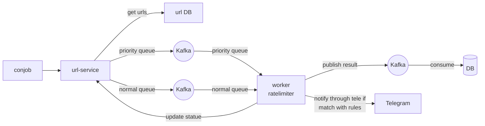

# Web Crawler

A simple web crawler written in Go that crawls websites and extracts information.

## Main Features

- Crawls web pages starting from a given URL with method GET, POST and CURL
- Manage multiple queue with priority for crawlers
- Run by cron job
- Send message to Telegram

## Technologies

```
- Go: 1.23.4
- Redis: 7-alpine
- Kafka: 3.7.1
- PostgreSQL: 17

- Ratelimit: "github.com/go-redis/redis_rate/v9"
- Cron job: "github.com/robfig/cron/v3"
- Gorm: "gorm.io/gorm"
```

# Architecture level 1 (tag-v1)

Is basic crawler 




<details>

```txt
title Crawler
sequenceDiagram
    participant cron-job
    participant crawler-service
    participant url-DB
    participant Kafka
    participant crawler-worker
    participant result-DB

    cron-job ->> cron-job: normal queue run every 5m
    cron-job ->> cron-job: priority queue run every 15m
    cron-job ->> crawler-service: trigger to get job
    crawler-service ->> url-DB: GetUrlByDomainsAndQueues
    crawler-service <-- url-DB: get urls
    crawler-service ->> Kafka: public message to queue by topic
    Kafka -->> crawler-worker: consume message
    crawler-worker ->> crawler-worker: crawl by url
    crawler-worker ->> result-DB: write data to result DB
```
</details>


# Architecture level 2 (tag-v2)

In Architecture level 1, we only query and execute 1 time. Let expand the problem with harder question
- Can we execute for daily, monthly job?
- As current we run sequencely job because a job is quite short response. What happend if long running job? example: download a large file, run a large step. => How to handle it? And in running time of that job, can we run another job?
- In actually, crawler include scheduler problem => split to scheduler + crawler


# How to run

Setup your environment variables in `.env.example` and change it to `.env`

```bash
# Start docker
docker-compose up -d
```

```bash
cd crawler-service

# Terminal 1
go run main.go server

make service


# Terminal 2
go run main.go crawler-worker

make worker
```

<details>

# 1. Create new bot and get token


# 2. Run command to get chat Id

```bash
curl -s https://api.telegram.org/bot${TOKEN}/getUpdates
```


# 3. Worker consumer message example

```txt
publish to crawler queue: normal, request: curl --location 'https://m.cafef.vn/du-lieu/Ajax/ajaxgoldprice.ashx?index=11' --header 'Accept: */*' --header 'Accept-Language: en-US,en;q=0.9,vi;q=0.8' --header 'Connection: keep-alive' --header 'Referer: https://m.cafef.vn/du-lieu/gia-vang-hom-nay/trong-nuoc.chn' --header 'Sec-Fetch-Dest: empty' --header 'Sec-Fetch-Mode: cors' --header 'Sec-Fetch-Site: same-origin' --header 'User-Agent: Mozilla/5.0 (Macintosh; Intel Mac OS X 10_15_7) AppleWebKit/537.36 (KHTML, like Gecko) Chrome/135.0.0.0 Safari/537.36 Edg/135.0.0.0' --header 'sec-ch-ua: "Microsoft Edge";v="135", "Not-A.Brand";v="8", "Chromium";v="135"' --header 'sec-ch-ua-mobile: ?0' --header 'sec-ch-ua-platform: "macOS"' --header 'Cookie: _ga=GA1.2.1174992577.1733489327; _ga_860L8F5EZP=GS1.1.1740282133.10.0.1740282328.0.0.0; ASP.NET_SessionId=wnors2tpgmcb0lwvqwebtsf5; favorite_stocks_state=1'
```
</details>
